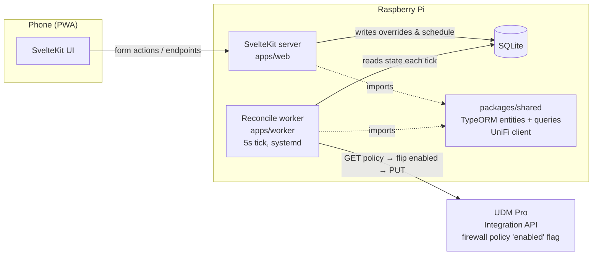
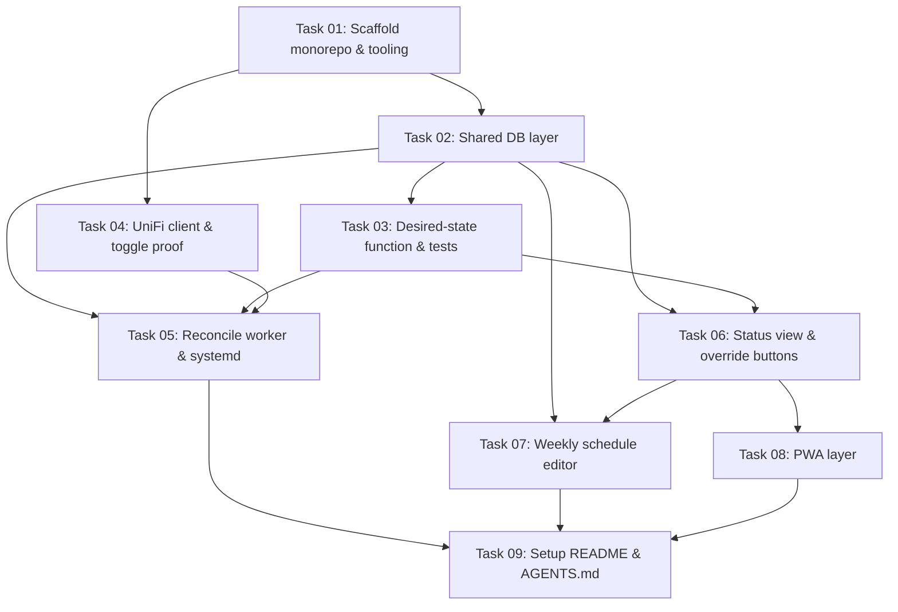

# Plan: Household Screen-Time Manager

## Original Work Order

> Create a plan for a screentime app that interacts with my local UDM Pro. I sketched out the broad details of what I want in @screen-time-app-plan.md. Accessing the UDM Pro / Ubiquiti API is detailed in the openapi spec I pulled from the Dashboard and saved as @udm-api-openapi-spec.json. Let me know if that is enough to describe and discover the API details that are needed. One note: @screen-time-app-plan.md talks about needing to manage a Traffic & Firewall Rule over a group of kids devices; I've since simplified that such that I have set up a 'Kids' Network, with a corresponding Wifi connection where all the kid devices are connected to. We can use the 'Kids' Network as the target for the Screen Time rules.

The referenced `screen-time-app-plan.md` was the user's build sketch containing the locked technology decisions, architecture sketch, and data model. All of its binding content has been folded into this plan (see Background → locked decisions, the Architectural Approach, and the data model in the Shared Data Layer section); this plan is self-contained and the sketch file is no longer required.

Refinement addendum (2026-08-07):

> I'd like to also specify what we use Tailwind CSS (via the @tailwindcss/vite plugin, plus the forms and typography official plugins tnd the Tailwind Prettier plugin for class sorting). Prettier should also be included in the project. For components, lets use shadcn-svelte for what we need.

## Plan Clarifications

| Question | Answer |
| --- | --- |
| How does the Kids-network block firewall policy come to exist in UniFi? | The user creates it manually in the UniFi console (source: Kids network, destination: external, action: Block, no schedule) and provides its policy ID to the app via configuration. The app never creates or discovers policies — it only toggles the one it is given. |
| Include the optional server-side "connection OK?" check in the web app? | No — skipped (YAGNI). The worker's per-tick error logging covers UniFi reachability. The web app remains a pure database front-end. |
| Is backwards compatibility required? | No. Greenfield repository; nothing existing to stay compatible with. The only external contract is the UniFi Integration API. |
| (Self-review, 2026-08-07) Worker tick interval? | Poll every **5 seconds** (not 60) so schedule changes are picked up nearly instantly, unless a serious performance issue emerges. The interval is configurable via an environment variable in `apps/worker/.env`. |
| (Self-review, 2026-08-07) How is configuration supplied? | Plain `.env` files local to the package that needs them (e.g. `apps/worker/.env`), each spec'd by a committed `.env.example`; setup docs include copying `.env.example` to `.env`. The UniFi API key is env-only — the user holds it and it is never committed or embedded in docs. |

## Executive Summary

This plan delivers a small, self-hosted household screen-time manager: a phone-friendly SvelteKit PWA that lets a non-technical family member (primary persona: the user's wife on an iPhone) see and control the kids' internet access, backed by a long-running worker process that enforces the decision by toggling a single firewall policy on a UniFi UDM Pro. The app owns all schedule logic; UniFi is reduced to a dumb on/off switch. The kids' devices are all on a dedicated "Kids" network, so a single firewall policy whose source matches that network is the entire enforcement surface.

The system is three cooperating pieces in one pnpm monorepo sharing one SQLite database: the SvelteKit app (writes user intent — schedules and overrides — to the database), the worker (on every tick — every 5 seconds by default, configurable via environment variable — computes desired internet state from schedule + overrides + now, and idempotently reconciles the UniFi policy's `enabled` flag to match), and a shared package holding the TypeORM data layer and the UniFi client. The app and worker never talk directly; the database is the shared blackboard, which makes every component restartable without losing state. The worker is the sole caller of UniFi, eliminating write races against the gateway.

Analysis of the provided OpenAPI spec (`docs/udm-api-openapi-spec.json`, UniFi Network API v10.5.67) resolved the work order's largest open question favorably: the **official UniFi Integration API can perform the toggle**, so the legacy `/proxy/network` cookie/CSRF fallback described in the sketch is not needed. The toggle is a read-modify-write: `GET` the firewall policy, flip `enabled`, `PUT` the full object back (the `PATCH` endpoint only supports `loggingEnabled` and cannot be used). The spec is sufficient to design the client. Auth was verified against the live controller (2026-08-07): `GET /v1/info` with the `X-API-KEY` header succeeded and returned `applicationVersion: 10.5.67`, confirming both the auth scheme and that the in-repo spec matches the running controller version.

## Context

### Current State vs Target State

| Current State | Target State | Why? |
| --- | --- | --- |
| Kids' internet access is controlled by hand-editing scheduled traffic/firewall rules in the UniFi console | A dedicated PWA with big, obvious controls manages access; UniFi is never touched day-to-day | The UniFi console is hostile to non-technical users; the primary operator is a non-technical household member on an iPhone |
| The schedule lives inside UniFi's rule scheduling | The app's SQLite database is the single source of truth for schedules and overrides; the UniFi policy is static and schedule-free | One owner of schedule logic; enables overrides like "+15 min" that UniFi scheduling cannot express |
| The block rule targets a group of kid devices | The block policy targets the "Kids" network (all kid devices connect via its WiFi) | The user simplified targeting: network-level matching removes per-device management from the rule entirely |
| No ad-hoc extensions — changing tonight's cutoff means editing rules in the console | One-tap "+15 min" / "+5 min" / "Pause now" / "Allow now" overrides layered over the weekly schedule | The most common real-world need is a small, immediate, temporary adjustment |
| Empty repository (planning docs only) | pnpm monorepo: `packages/shared`, `apps/web` (SvelteKit PWA), `apps/worker` (systemd-managed reconcile loop) on the Raspberry Pi | Greenfield build per the locked decisions in the work order sketch |

### Background

- **Environment**: a UniFi UDM Pro runs the UniFi Network application (v10.5.67 per the spec). A Raspberry Pi (Debian/Ubuntu-based) on the same LAN hosts the app. A "Kids" network with its own WiFi SSID already exists and carries all kid devices.
- **Locked decisions from the work order** (binding): TypeScript everywhere; SvelteKit; installable PWA via the Vite PWA plugin with **no push notifications**; SQLite as the single source of truth; TypeORM with entities in the shared package (decorator support enabled in the shared TS config); the worker is a long-running Node process ticking on an interval (not cron) under systemd; single pnpm-workspace monorepo; enforcement latency of up to one tick is accepted and **no** app-to-worker poke/notify channel may be added; reconcile idempotently rather than detecting schedule edges. *(The sketch's 60-second tick was revised to a 5-second default by self-review feedback — see Plan Clarifications.)*
- **Locked decisions from the refinement addendum** (binding): styling with **Tailwind CSS** integrated via the `@tailwindcss/vite` plugin, plus the official `@tailwindcss/forms` and `@tailwindcss/typography` plugins; **Prettier** included in the project with **`prettier-plugin-tailwindcss`** for automatic class sorting; UI components built with **shadcn-svelte** for whatever components the app needs.
- **OpenAPI spec findings** (from `docs/udm-api-openapi-spec.json`, the authoritative API reference for this plan):
  - Server URL: `https://192.168.1.1/proxy/network/integration`; all resource paths are site-scoped (`/v1/sites/{siteId}/…`).
  - Firewall policies expose `enabled: boolean` on the read model and on the required fields of the `PUT` ("Create or update firewall policy") body. `PATCH` supports only `loggingEnabled`, so **toggling requires GET → flip `enabled` → PUT the full object**.
  - Policies are zone-based: `source` requires a `zoneId` and supports a `networkFilter` traffic filter that matches by network IDs — this is how the manually created policy targets the Kids network. The app does not construct this; it only preserves it through the read-modify-write.
  - Supporting read endpoints exist for setup-time discovery of IDs: `GET /v1/sites`, `GET /v1/sites/{siteId}/networks`, `GET /v1/sites/{siteId}/firewall/zones`, `GET /v1/sites/{siteId}/firewall/policies`.
  - The spec's `securitySchemes` is empty, but auth is **verified** (2026-08-07): a live `GET /v1/info` with the `X-API-KEY` header (key generated in the UniFi console) returned `{"applicationVersion":"10.5.67"}` — the header auth works and the controller version matches the spec.
- **Configuration approach** (per self-review feedback): each package that needs runtime configuration reads a plain `.env` file local to that package — notably `apps/worker/.env` (gateway URL, API key, site ID, policy ID, SQLite path, timezone, tick interval). Every `.env` is git-ignored and spec'd by a committed `.env.example`; setup documentation includes copying `.env.example` to `.env` and filling in values. The user already holds a generated API key; it lives only in their local `.env`, never in the repo or docs.
- **Manual UniFi setup owned by the user** (prerequisite, documented not automated): create the static block policy (source: Kids network via network filter in its zone; destination: external zone; action: Block; **no schedule**), generate an API key, and supply the policy ID, site ID, gateway URL, and API key to the app's environment configuration. Rule semantics: policy **enabled** ⇒ kids' internet **OFF**; policy **disabled** ⇒ internet **ON**.
- Old approach being replaced: the previous device-group rule with in-UniFi scheduling is retired by the user as part of that manual setup.

## Architectural Approach

The system is a single pnpm workspace with three packages sharing one SQLite file. User intent flows into the database through the SvelteKit server; enforcement flows out of the database through the worker to the UDM Pro. Nothing else crosses those boundaries.



### Monorepo Foundation

**Objective**: One repository, one TypeScript configuration story, one copy of every shared concern.

pnpm workspace with `packages/shared`, `apps/web`, and `apps/worker`. A shared `tsconfig.base.json` enables the decorator and metadata emission options TypeORM requires, so entities compile identically wherever they are imported. Both apps depend on `packages/shared` via workspace protocol. The shared package is the only place database logic and UniFi logic exist.

```
screen-time/
├── package.json                # pnpm workspace root
├── pnpm-workspace.yaml
├── tsconfig.base.json          # shared TS config (decorators enabled for TypeORM)
├── docs/
│   └── udm-api-openapi-spec.json   # UniFi Integration API contract reference
├── packages/
│   └── shared/                 # DB layer + UniFi client + shared types
│       └── src/
│           ├── db/             # TypeORM data source, entities, queries
│           ├── unifi/          # UniFi client (auth + toggle rule)
│           └── index.ts
└── apps/
    ├── web/                    # SvelteKit PWA
    └── worker/                 # long-running Node process
```

### Shared Data Layer (packages/shared)

**Objective**: A single TypeORM data source and entity set that both halves import, making SQLite the sole coordination mechanism.

Entities per the work order's data model, treated as a starting point: **Profile** (`id`, `name`, `unifiRuleId` — the manually created firewall policy's ID; initially one row, "Kids"), **ScheduleWindow** (`id`, `profileId`, `dayOfWeek`, `startMinute`, `endMinute` — recurring *allowed* windows in local time; outside all windows internet is off), and **Override** (`id`, `profileId`, `type` ∈ {`extend`, `allow_now`, `block_now`}, `effectiveUntil`, `createdAt` — transient adjustments layered over the schedule; expired overrides are ignored and prunable). The package also exports the pure desired-state function — given `now`, a profile's windows, and its active overrides, return ON/OFF — so the decision logic is testable without a database or gateway. The SQLite file lives at a configurable filesystem path shared by both processes.

### Shared UniFi Client (packages/shared)

**Objective**: The one place that knows how to talk to the UDM Pro, shaped by the OpenAPI spec's actual capabilities.

A thin client over the official Integration API: base URL `https://<gateway>/proxy/network/integration`, authenticating with the API key via the `X-API-KEY` header on every request (verified working against the live controller on 2026-08-07). Core operation: fetch firewall policy by ID, and set its `enabled` state via read-modify-write (`GET` the policy, mutate only `enabled`, `PUT` the complete object back). The client treats the policy body as opaque apart from `enabled`, preserving the user's manually configured Kids-network targeting untouched. Because the UDM Pro serves a self-signed certificate on the LAN, the client must support the local TLS trust situation explicitly (pinned/insecure-local handling confined to this client). The proof gate from the work order applies: demonstrate a manual enable/disable round-trip from the Pi before any dependent work proceeds.

### Reconcile Worker (apps/worker)

**Objective**: Sole enforcer — converge reality to intent every tick, forever.

A long-running Node process: open the shared data source, then loop on a configurable interval — **default 5 seconds**, read from an environment variable in `apps/worker/.env` — so schedule and override changes are picked up nearly instantly. Each tick, for every profile: read windows and overrides, compute desired state via the shared function, and reconcile the policy's `enabled` flag (internet ON ⇒ policy disabled; OFF ⇒ enabled) — no edge detection, no memory of previous ticks. Because ticks are frequent, reconciliation reads the policy first and only issues the `PUT` when the actual state differs from the desired state, so the gateway sees a write only on real transitions, not every 5 seconds. Each tick is wrapped so a transient UniFi or database error logs and waits for the next tick rather than killing the process. Ships with a systemd unit (`Restart=always`, `EnvironmentFile` pointing at the worker's `.env`, `WantedBy=multi-user.target`) and documented enable steps. The worker is the only UniFi caller in the system.

### SvelteKit App (apps/web)

**Objective**: A dead-simple phone UI for the least technical household member; a pure database front-end.

Server-side endpoints and form actions perform all reads/writes; UniFi credentials never reach the browser (the web app holds no UniFi credentials at all — it never calls the gateway). UI, in priority order: an at-a-glance status per profile ("Kids' internet: ON until 8:00 PM" / "OFF"), big one-tap buttons — **+15 min**, **+5 min**, **Pause now**, **Allow now** — that create or extend Override rows, and a weekly schedule editor for ScheduleWindows (may be denser since the user owns it, but stays legible). Status shown is the app's computed intent from the same shared desired-state function; with the worker's 5-second tick, changes take effect nearly instantly.

Styling and components (per the refinement addendum): Tailwind CSS wired through the `@tailwindcss/vite` plugin in the SvelteKit Vite config, with the official `@tailwindcss/forms` and `@tailwindcss/typography` plugins enabled; UI built from **shadcn-svelte** components (initialized in `apps/web`, adding only the components actually used — buttons, cards, dialogs, form controls as needed). Repo-wide **Prettier** with `prettier-plugin-tailwindcss` keeps class lists sorted; formatting configuration lives at the workspace root so all packages share it.

### PWA Layer and Operational Documentation

**Objective**: Home-screen install on iOS and Android, and a setup path a future self can follow.

Vite PWA plugin provides the manifest and service worker so the app installs to the home screen and launches fullscreen. No push notifications — deliberately excluded. A short setup README covers: the manual UniFi prerequisites (create the Kids-network block policy without a schedule, generate the API key, collect policy/site IDs), environment configuration for both processes, systemd enablement, and the iOS "Add to Home Screen" note.

## Risk Considerations and Mitigation Strategies

<details>
<summary>Technical Risks</summary>

- **Read-modify-write PUT round-trip fidelity**: the PUT body requires the full policy object; if the read model and write model diverge (extra read-only fields, `metadata`), a naive echo-back could be rejected or drop settings.
    - **Mitigation**: prove the GET→flip→PUT round-trip manually against a throwaway/actual policy early (the plan's explicit proof gate), and strip read-only fields per the spec's "Create or update firewall policy" schema.
- **Controller upgrades shifting the API**: the Integration API is versioned with the Network application; an upgrade could change schemas.
    - **Mitigation**: all UniFi knowledge is confined to the shared client (one-file blast radius); the spec file in-repo records the version the client was built against.
- **Self-signed TLS on the gateway**: Node will reject the UDM Pro's local certificate by default.
    - **Mitigation**: handle trust explicitly inside the UniFi client only, never process-wide.
- **SQLite concurrent access** (web app and worker share one file):
    - **Mitigation**: two processes with brief transactions (the worker's 5-second reads are trivial; writes happen only on user actions and state transitions); enable WAL mode and rely on TypeORM's serialized access — well within SQLite's comfort zone.

</details>

<details>
<summary>Implementation Risks</summary>

- **Timezone/DST correctness**: schedule windows are minutes-since-local-midnight; the DST boundary can skip or repeat wall-clock times, and a UTC-configured Pi could silently shift every window.
    - **Mitigation**: compute desired state in the household's local timezone explicitly (not process default); keep the desired-state function pure and unit-test DST-boundary and midnight-crossing cases.
- **Override/schedule interaction ambiguity** (e.g. `block_now` during an allowed window vs. `extend` outside any window):
    - **Mitigation**: define precedence in the shared desired-state function as the single authority, covered by unit tests; the UI only creates overrides, never computes state independently.
- **Manual prerequisite drift**: the app depends on a correctly configured, schedule-free policy and valid IDs supplied by the user; a wrong ID means toggling the wrong rule.
    - **Mitigation**: setup README gives an exact checklist; the worker logs the policy name it is toggling on startup so a mismatch is visible immediately.

</details>

<details>
<summary>Operational Risks</summary>

- **Worker down ⇒ frozen state** (whatever the policy was last set to persists):
    - **Mitigation**: systemd `Restart=always` plus boot enablement; the reconcile model self-heals to correct state on the first tick after any outage.
- **Manual edits in the UniFi console fighting the worker**: a hand-toggled policy is overwritten within seconds.
    - **Mitigation**: documented expectation — the app is the sole owner of this policy's `enabled` flag; UniFi-side changes to it are unsupported.

</details>

## Success Criteria

### Primary Success Criteria

1. Toggling works end-to-end: with the worker running, changing intent in the database (schedule or override) results in the UniFi firewall policy's `enabled` flag matching the computed desired state within one tick (default 5 seconds), verified against the live UDM Pro.
2. The weekly schedule is enforced: internet is ON for the Kids network profile during defined ScheduleWindows and OFF outside them, with overrides (`extend`, `allow_now`, `block_now`) taking precedence per the defined semantics until `effectiveUntil`.
3. The PWA installs to a phone home screen, launches fullscreen, and its status view and one-tap buttons (+15, +5, Pause now, Allow now) work — a non-technical user can change access without seeing UniFi.
4. The worker runs under systemd, survives a reboot and a forced crash, and a transient UniFi outage produces a logged error and successful reconciliation on a later tick, not a dead process.
5. The web app holds no UniFi credentials and makes no UniFi calls; the worker is the only component communicating with the gateway.

## Self Validation

Concrete verification steps to execute after all tasks are complete (on/against the deployment environment where noted):

1. **UniFi round-trip**: run a small script (or the shared client via a REPL/CLI entry) with the configured env to `GET` the block policy by ID, flip `enabled`, `PUT` it back, re-`GET` to confirm the change, then restore. Capture the before/after `enabled` values in output.
2. **Worker reconciliation**: with the worker running under systemd, insert a `block_now` override via the web UI (or direct DB write), then poll the policy over the Integration API and confirm `enabled: true` appears within ~15 seconds; delete/expire the override during an allowed window and confirm `enabled: false` follows on a subsequent tick. `journalctl` output for the unit shows reconcile logs, writes to the gateway only on state transitions (not every tick), and no crash.
3. **Desired-state unit tests**: run the shared package's test suite covering window boundaries, midnight-adjacent windows, each override type's precedence, expired overrides, and a DST transition date — all green.
4. **Web UI exercise**: using Playwright (or the playwright-cli skill) against the running app: load the status page and screenshot the profile status; tap **+15 min** and verify a new/extended `extend` Override row exists in SQLite (query via `sqlite3`) and the status text updates; edit a schedule window in the editor and verify the `ScheduleWindow` row changed.
5. **PWA installability**: fetch the deployed app's web manifest and service-worker registration over HTTP (curl + browser devtools audit) confirming installability criteria; verify the iOS "Add to Home Screen" instructions are present in the README.
6. **Credential isolation**: grep the built web app's client bundle output for the API key env variable name and value patterns to confirm no UniFi credential reaches browser assets; confirm the web app's runtime env (per its config) contains no UniFi key.
7. **Resilience**: `systemctl kill` the worker and confirm systemd restarts it and the next tick reconciles; temporarily point the client at an unreachable gateway URL and confirm the tick logs the error and the process stays alive, then restore.

## Documentation

- **README.md** (new, repo root): what the system is, the manual UniFi setup checklist (create the Kids-network block policy with no schedule, generate the API key, collect site/policy IDs), environment configuration for web and worker — including copying each package's `.env.example` to `.env` and filling in values — pnpm/build/run instructions, systemd install/enable steps, and iOS/Android install-to-home-screen notes.
- **Systemd unit file** shipped in-repo with commented `EnvironmentFile` usage.
- **`.env.example` files** committed per package that needs configuration — notably `apps/worker/.env.example` documenting every required variable (gateway URL, API key, site ID, policy ID, SQLite path, timezone, tick interval) without secret values; actual `.env` files are git-ignored.
- **AGENTS.md / CLAUDE.md** (new, repo root): monorepo layout, the "worker is the sole UniFi caller" and "no poke channel" invariants, pointer to `docs/udm-api-openapi-spec.json` as the API reference, and locked decisions so future AI-assisted work does not relitigate them.

## Resource Requirements

### Development Skills

- TypeScript across Node and SvelteKit; TypeORM with decorators; SQLite behavior (WAL, file locking).
- SvelteKit form actions/endpoints and PWA tooling (Vite PWA plugin, service worker basics, iOS install quirks).
- Tailwind CSS (v4-style Vite integration) and shadcn-svelte component conventions.
- HTTP client work against a self-signed-TLS local API; reading OpenAPI 3.1 schemas.
- Linux service operation: systemd units, journald, environment files, deployment on Raspberry Pi (ARM).
- Timezone/DST-aware time arithmetic.

### Technical Infrastructure

- pnpm workspace tooling; Node.js LTS on the dev machine and the Raspberry Pi.
- Frontend stack: Tailwind CSS with `@tailwindcss/vite`, `@tailwindcss/forms`, `@tailwindcss/typography`; shadcn-svelte; Prettier with `prettier-plugin-tailwindcss` at the workspace root.
- The UDM Pro with Integration API enabled, an API key, and the manually created Kids-network block policy (user-provided prerequisite).
- `docs/udm-api-openapi-spec.json` (in-repo) as the API contract reference.
- SQLite (via TypeORM driver); Playwright for UI validation; a test runner for the shared package's unit tests.
- LAN access from the Pi to the UDM Pro on 443.

## Integration Strategy

Integration with the existing household UniFi setup is deliberately minimal and one-directional: the system touches exactly one firewall policy's `enabled` field via the official Integration API and reads nothing else at runtime. Device targeting remains entirely a UniFi-side concern (membership in the Kids network/WiFi). The retirement of the old scheduled device-group rule and creation of the new static Kids-network policy is a manual, user-owned migration performed once during setup, guided by the README checklist. No other systems integrate with the app.

## Notes

- The work order's fallback path (legacy `/proxy/network` cookie+CSRF API) is **not planned**: spec analysis confirmed the official Integration API supports the required toggle. If live verification ever contradicts this, the isolation of the UniFi client keeps the fallback a contained change — but it is out of scope unless proven necessary.
- Do not add: push notifications, an app→worker notification channel, UniFi calls from the web app, in-UniFi scheduling, policy creation/discovery logic, or a connection-OK check (explicitly declined).
- Enforcement latency is one worker tick — default 5 seconds, configurable via `apps/worker/.env` — so changes feel nearly instant. The no-poke-channel rule stands; the frequent tick is the whole mechanism.
- `Override.type` semantics to be finalized during implementation within the shared desired-state function: `extend` pushes the current/most recent allowed window's cutoff to `effectiveUntil`; `allow_now`/`block_now` force the state until `effectiveUntil` regardless of schedule; explicit precedence is defined and unit-tested there (single authority).

### Change Log

- 2026-08-07: Refinement — locked in frontend/tooling decisions per user addendum: Tailwind CSS via `@tailwindcss/vite` with the official forms and typography plugins; Prettier added project-wide with `prettier-plugin-tailwindcss` for class sorting; shadcn-svelte adopted as the component library. Updated Background (locked decisions), the SvelteKit App component section, and Resource Requirements accordingly. No scope, architecture, or data-model changes.
- 2026-08-07: Made the plan self-contained — inlined the repo layout tree and removed binding-by-reference language pointing at `screen-time-app-plan.md`, so the sketch file at the repo root can be deleted. `udm-api-openapi-spec.json` remains a required in-repo reference (later moved to `docs/`).
- 2026-08-07: Applied self-review feedback — worker tick changed from 60 seconds to a 5-second default, configurable via environment variable; reconciliation now writes to the gateway only on state mismatch (a consequence of the faster tick); configuration formalized as per-package `.env` files with committed `.env.example` specs and a copy step in setup docs. The API key remains env-only and is never embedded in the repo. Latency references updated throughout.
- 2026-08-07: Auth VERIFY item resolved — the user ran `GET /v1/info` against the live controller with the `X-API-KEY` header and received `{"applicationVersion":"10.5.67"}`. Auth scheme confirmed; controller version matches the in-repo spec. The "auth scheme unverified" technical risk was removed. One VERIFY item remains open: proving the GET→flip→PUT toggle round-trip on the firewall policy.

## Execution Blueprint

**Validation Gates:**
- Reference: `/config/hooks/POST_PHASE.md`

### Dependency Diagram



### ✅ Phase 1: Foundation
**Parallel Tasks:**
- ✔️ Task 01: Scaffold pnpm monorepo and frontend tooling — `completed`

### ✅ Phase 2: Shared Building Blocks
**Parallel Tasks:**
- ✔️ Task 02: Shared TypeORM data layer (SQLite) (depends on: 01) — `completed`
- ✔️ Task 04: UniFi Integration API client with live toggle proof (depends on: 01) — `completed`

### ✅ Phase 3: Core Logic
**Parallel Tasks:**
- ✔️ Task 03: Desired-state function with unit tests (depends on: 02) — `completed`

### ✅ Phase 4: Enforcement and Primary UI
**Parallel Tasks:**
- ✔️ Task 05: Reconcile worker with systemd unit (depends on: 02, 03, 04) — `completed`
- ✔️ Task 06: Status view and override buttons (depends on: 02, 03) — `completed`

### Phase 5: Completing the Web App
**Parallel Tasks:**
- Task 07: Weekly schedule editor (depends on: 02, 06)
- Task 08: PWA layer (manifest + service worker) (depends on: 06)

### Phase 6: Documentation
**Parallel Tasks:**
- Task 09: Setup README and AGENTS.md (depends on: 05, 07, 08)

### Post-phase Actions

### Execution Summary
- Total Phases: 6
- Total Tasks: 9
