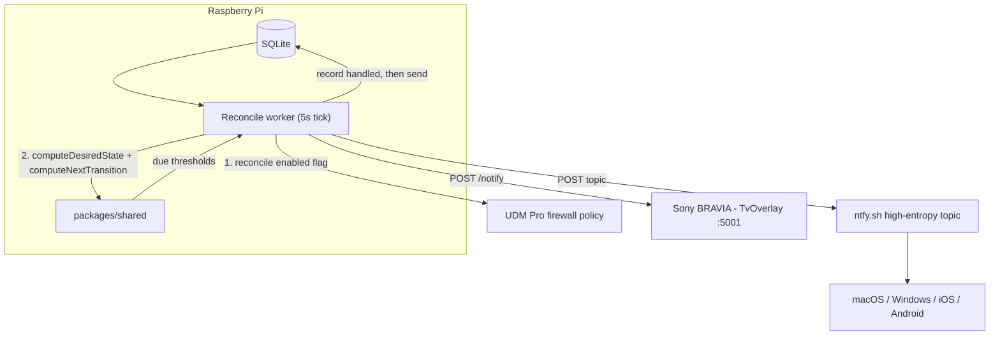
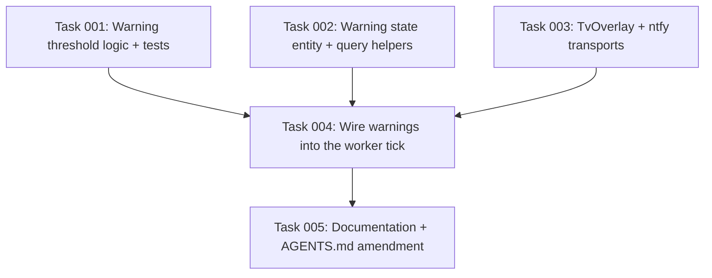

# Plan: Pre-Cutoff Screen Time Warning Notifications

## Original Work Order

> lets plan out the push notification feature. When we are inside an active screen time window, as the time runs down, lets show a simple notification (not fixed) at the 30min left, 15min left, 10min left, 5min left, 2min left, and 1min left. Each time the notification should be visible for 15seconds. The last 1min left should be visible for the full minute. Use TVOverlay as discussed to push notifications to the Sony TV. Use ntfy to push to mac, windows, ios and andriod clients. On the ntfy side, lets work through the best way to setup and host it. I don't want to pay for ntfy, and it would be find to use a public topic with a unique name like `screen-time.example.com` if possible. I'd be open to hosting an ntfy server on the pi if that is an option and would be valuable.

Preceding investigation in the same conversation established the delivery mechanism. The ntfy Android app is not installable from the Play Store on Google TV (it declares no leanback support), which is why the Sony BRAVIA uses TvOverlay instead. TvOverlay's REST API was verified working from the Raspberry Pi against the Bravia on port 5001: both `POST /notify_fixed` (set and clear) returned `{"success":true,"message":"Fixed notification received"}`. The Bravia holds a fixed DHCP-reserved address in the UDM.

## Plan Clarifications

| Question | Answer |
| --- | --- |
| How should ntfy be hosted, given no paid plan? | **ntfy.sh with a high-entropy public topic.** Self-hosting was investigated and rejected: iOS forbids the background processing instant push requires, so a self-hosted server must still forward `poll_request` messages to ntfy.sh via `upstream-base-url` to reach APNs. Self-hosting therefore adds a server, TLS, and reachability requirements while *retaining* the ntfy.sh dependency. It buys privacy of message content only, which does not justify the cost for the payload "Internet turns off in 15 minutes". |
| Is the ntfy.sh free tier sufficient? | Yes, by three orders of magnitude. The published limit is a 60-message burst replenishing at one message per 5 seconds. This feature sends 6 messages per ON→OFF transition — roughly 12–18 per day. |
| Is `screen-time.example.com` an acceptable topic name? | **No.** On ntfy.sh the topic name is the only access control, and it grants *publish* as well as subscribe. A name derived from a public domain is guessable, which would let a third party — or a kid who reads the topic out of the ntfy client on their own laptop — inject fake warnings. The topic must be a high-entropy name treated as a secret. |
| Should warnings fire only before scheduled window ends, or before any cutoff? | **Any ON→OFF transition**, including a `+15 min` extension or an `Allow now` grant expiring. This is exactly what `computeNextTransition` already returns, so it requires no additional logic, and it avoids the perverse outcome where ad-hoc, least-predictable cutoffs are the unannounced ones. |
| Is backwards compatibility required? | **Yes, in the specific sense that the new configuration must be optional.** Both new env vars default to "transport disabled", so the worker running today continues to run unchanged if they are absent. Notification failures must never delay or break the firewall reconcile. |
| Does "visible for 15 seconds" apply to both transports? | **No — TvOverlay only.** Its `/notify` endpoint takes a `duration` in seconds. ntfy has no auto-dismiss concept; its notifications persist until dismissed or aged out by the receiving OS. The 15s/60s requirement is therefore a property of the TV channel alone. |

## Executive Summary

Today the kids' internet stops without warning. The schedule and overrides are enforced to the second by the worker, but the first signal a kid gets is a dead connection mid-game. This plan adds a graduated countdown — notifications at 30, 15, 10, 5, 2 and 1 minutes before any ON→OFF transition — delivered to the devices the kids are actually using.

Two transports cover the device mix, because no single one reaches all of it. The Sony BRAVIA runs **TvOverlay**, which draws an overlay on top of whatever is playing; this is both the only practical channel for Google TV and the best-suited one, since a TV notification must survive fullscreen video. Laptops (macOS, Windows) and phones/tablets (iOS, Android) use **ntfy.sh** with a high-entropy public topic — free, no server to operate, and served by mature first-party apps on every platform in the mix.

The trigger requires no new scheduling machinery. `computeNextTransition` in `packages/shared/src/next-transition.ts` already returns the exact instant the current state flips, correct across DST and across the schedule/override precedence rules, and the worker already ticks every 5 seconds. The only genuinely new state is a small table recording which thresholds have been handled for which cutoff, so that a warning fires once and a worker restart does not replay it. Everything else is a pure function over data the system already computes, tested the way `computeDesiredState` is tested.

## Context

### Current State vs Target State

| Current State | Target State | Why? |
| --- | --- | --- |
| The internet cuts out with no warning; the first signal is a dead connection | Six escalating warnings at 30/15/10/5/2/1 minutes before any cutoff | A hard stop mid-activity is the actual daily friction; a countdown lets kids finish or save |
| The worker's only outbound integration is the UniFi Integration API | The worker additionally performs fire-and-forget HTTP POSTs to TvOverlay and ntfy.sh | Enforcement and notification are both worker concerns; the worker is the only process that knows the tick |
| `computeNextTransition` is used only to anchor "+N minutes" extensions | It additionally drives warning thresholds | The cutoff instant is already computed correctly, including DST and override precedence — re-deriving it would violate the single-authority rule |
| The worker holds no state between ticks; every tick reconciles absolute desired state | One small table records which (transition, threshold) pairs have been handled | A notification is inherently an at-most-once edge, unlike the idempotent policy reconcile — it cannot be derived from current state alone |
| `AGENTS.md` bans push notifications outright and lists them under "do not add" | The ban is narrowed to its real intent: the PWA still ships no web push; the worker may send outbound notifications | The original decision was about not building a push pipeline into the web app; outbound POSTs from the worker are a different mechanism and are now a deliberate, recorded amendment |
| The Bravia is a passive client of the Kids network | The Bravia additionally runs TvOverlay listening on port 5001 for notifications from the Pi | Google TV cannot install the ntfy app; the overlay is the only channel that reaches the TV |

### Background

- **Verified prerequisites.** TvOverlay is installed on the Bravia and on the user's Pixel 9. `POST /notify_fixed` was exercised from the Pi and from a workstation with both `visible: true` and `visible: false`, each returning HTTP success. The Bravia has a fixed DHCP reservation in the UDM, so addressing it by IP is stable. Inter-VLAN reachability from the Pi to the Bravia on port 5001 is confirmed working.
- **TvOverlay API contract.** The authoritative field definitions are the schema files in the TvOverlay repository (`json/notification.json`, `json/fixed_notification.json`) and the README table — **not** `postman/postman_collection.txt`, whose sample bodies are stale (`seconds` for `duration`, `text` for `message`, and `appTitle`/`appIcon`/`color` for `source`/`smallIcon`/`smallIconColor`). Simple notifications are `POST /notify` and accept `id`, `title`, `message`, `source`, `image`, `video`, `largeIcon`, `smallIcon`, `smallIconColor`, `corner` (`bottom_start`/`bottom_end`/`top_start`/`top_end`) and `duration` (integer seconds). All fields are optional.
- **ntfy.sh characteristics.** Publishing is a plain `POST` to `https://ntfy.sh/<topic>` with the body as the message text and optional `Title`, `Priority` and `Tags` headers. No account or API key is required for a public topic. The topic name is the sole access control and confers publish rights as well as subscribe rights.
- **ntfy client story per platform.** First-party native apps exist for **iOS and Android** only. ntfy ships **no native desktop app**; its official desktop route is the same web app installed as a **PWA**, which yields a standalone window, real OS notifications, and an unread badge. Third-party native desktop clients are listed on ntfy's integrations page (Electron, Tauri and native WPF builds), but none is endorsed by the project, and installing unvetted software on the kids' laptops is a worse trade than accepting the PWA's one limitation. **The PWA is therefore the chosen desktop path for both macOS and Windows.**
- **Desktop delivery has a structural gap.** Per ntfy's documentation, on desktop "you generally need either your browser or the web app open to receive notifications, though the ntfy tab doesn't need to be open". The tab may be closed but the browser or installed PWA must be *running*; a laptop in a full-screen game with no browser open receives nothing. This constraint does not apply to iOS, Android, or the TV overlay. It is accepted rather than engineered around (see Product Risks).
- **Why self-hosting was rejected** (see Plan Clarifications): iOS instant delivery requires forwarding poll requests to ntfy.sh regardless, so self-hosting does not remove the third-party dependency — it adds a server, a TLS certificate, and a reachability requirement on top of it.
- **Sensitivity of the payload.** The message text is "Internet turns off in N minutes". It contains no identifiers, no household name, and no schedule detail. This is what makes a third-party relay acceptable here; it would not be for richer content.
- **Existing invariants this plan interacts with.** The worker remains the sole UniFi caller. SQLite remains the only channel between the web app and the worker — this feature adds no app↔worker signalling. The web app is untouched.

## Architectural Approach

The warning path hangs off the existing reconcile tick as a second, strictly subordinate step. Enforcement runs first and is never allowed to depend on, wait for, or fail because of notification delivery.

### Warning Threshold Logic (packages/shared)

**Objective**: Decide *which* warnings are due, as a pure function, so the rule is unit-testable and lives beside the other decision logic rather than inside the worker loop.

A new pure module in `packages/shared/src` exports the threshold constant `[30, 15, 10, 5, 2, 1]` (minutes) and a function that, given `now`, the cutoff instant, and the set of thresholds already handled for that cutoff, returns which threshold to send and which to record as handled without sending. It sits alongside `desired-state.ts` and `next-transition.ts` with colocated unit tests, and it derives the cutoff exclusively from `computeNextTransition` — never by re-reading windows or overrides itself, preserving the single-authority rule.

A threshold `T` becomes due at `cutoff − T minutes`. On each tick the function considers thresholds that are due and not yet handled, and applies two rules:

- **Staleness suppression.** A due threshold is sent only if it came due within a short grace period (60 seconds, comfortably wider than the 5-second tick). Anything older is recorded as handled but not sent. This is what stops a worker that restarts at 4 minutes remaining from firing 30, 15, 10 and 5 as a single burst of nonsense.
- **One per tick.** If more than one threshold is eligible in the same tick, only the smallest — the most urgent and most accurate — is sent; the larger ones are recorded as handled. This keeps behaviour deterministic under a slow or delayed tick.

Warnings are evaluated only when the profile's desired state is currently `ON` and a transition exists inside the lookahead horizon; in that situation the next transition is necessarily to `OFF`, so no separate direction check is needed.

### Warning State Persistence (packages/shared)

**Objective**: Make "warn once" survive a worker restart, without introducing any second source of truth.

A new TypeORM entity records one row per handled `(profileId, cutoff instant, threshold)` triple, registered in the shared data source so `synchronize: true` creates it on next startup. A unique constraint across those three columns makes double-handling impossible even under an unexpected concurrent tick.

Two design points are deliberate:

- **A row means "handled", not "delivered".** Thresholds suppressed for staleness are recorded too, because the goal is to never revisit them.
- **The row is written before the HTTP send is attempted.** If the process dies mid-send the warning is lost rather than repeated. For a countdown that a kid sees, a missed warning is a minor degradation while a repeated or duplicated one is actively confusing — so at-most-once is the correct bias.

Because the cutoff instant is part of the key, an override that moves the cutoff produces a different key and correctly re-arms the whole ladder. Rows are pruned opportunistically once their cutoff is in the past, following the existing `pruneExpiredOverrides` pattern, so the table stays small.

### Notification Transports (packages/shared)

**Objective**: Two small, independent HTTP clients that mirror how the UniFi client is structured — defined in `packages/shared`, called only by the worker.

A new `notify/` directory beside `unifi/` holds one client per transport behind a common minimal interface taking a title, a message, and a display duration. Both use `fetch` with a short hard-coded timeout via `AbortSignal.timeout`, and both resolve rather than throw on failure, logging the outcome. Neither is configurable beyond its target URL — no retry policy, no priority escalation, no per-device targeting.

- **TvOverlay client**: `POST {TVOVERLAY_URL}/notify` with a JSON body carrying `title`, `message`, a stable `id` per threshold, `smallIcon`, `corner`, and `duration` — 15 seconds for every threshold except the 1-minute warning, which uses 60 so it stays on screen through to the cutoff.
- **ntfy client**: `POST {NTFY_TOPIC_URL}` with the message as the request body and the title as a header. The `duration` concept is absent from ntfy and is simply not passed.

Message text is identical across transports: a title of `Screen time` and a body of `Internet turns off in N minutes`, correctly singular at one minute.

### Worker Integration (apps/worker)

**Objective**: Add the warning step to the existing tick without giving notification delivery any power over enforcement.

Configuration arrives through two new optional variables in `apps/worker/.env`: the full ntfy topic URL and the TvOverlay base URL. Each is read with the existing optional-env pattern rather than `requireEnv`; an unset variable disables that transport, which is what makes this deployable to the running Pi before `.env` is touched. Startup logs which transports are active so a typo is visible immediately.

Within `tick()`, the warning evaluation runs **after** the UniFi reconcile for each profile, inside its own `try`/`catch`. A thrown error there is logged and swallowed. Combined with the per-request timeout, this means an unplugged TV, a DNS failure, or an ntfy.sh outage costs at most a few seconds of one tick and cannot prevent the firewall policy from being reconciled.

## Risk Considerations and Mitigation Strategies

Technical Risks

- **Third-party dependency on ntfy.sh**: an outage or rate-limit change silently stops laptop and phone warnings.
    - **Mitigation**: failures are logged per send; the TV channel is independent and unaffected; enforcement is entirely unaffected. Volume sits three orders of magnitude below the published burst limit, so rate limiting is not a realistic trigger.
- **Topic name is the only access control, and grants publish rights**: a guessable topic would let anyone inject fake warnings or read them.
    - **Mitigation**: use a high-entropy topic name, treat it as a secret, keep it out of the repository with only a placeholder in `.env.example`, and document that it must not be derived from the household domain.
- **TvOverlay is killed by Android battery optimization, or loses its overlay permission**: POSTs return success while nothing renders.
    - **Mitigation**: document the two ADB setup commands from the TvOverlay README (`appops set … SYSTEM_ALERT_WINDOW allow` and the `deviceidle` allowlist) as required setup, and include an on-TV visual check in Self Validation rather than trusting the HTTP status.
- **Notification work slows or breaks the reconcile tick**: the enforcement guarantee is the thing that actually matters.
    - **Mitigation**: sends run after reconcile, in a separate `try`/`catch`, with a short per-request timeout; no retries.

Implementation Risks

- **Threshold logic drifts from the schedule/override authority**: re-deriving cutoffs from windows would create a second source of truth.
    - **Mitigation**: the warning module takes the cutoff as an input and the worker supplies it from `computeNextTransition`; the module never reads windows or overrides.
- **Restart or downtime produces a burst of stale warnings**: worst failure mode for a notification feature, because it trains people to ignore it.
    - **Mitigation**: the staleness grace rule and the one-per-tick rule, both covered by unit tests including an explicit restart scenario.
- **Schema addition relies on `synchronize: true` against a live database**: the table is additive, but this is the first schema change made with real data present.
    - **Mitigation**: the change is purely a new table with no alteration to existing entities; back up the SQLite file before the first post-deploy start, and verify the table's presence as a validation step.

Product Risks

- **Desktop warnings are missed when no browser is running**: the ntfy PWA only receives while the browser or the installed app is running, so a full-screen game on a laptop is exactly the case most likely to miss a warning — and exactly the case where a warning matters most.
    - **Mitigation**: accepted for the initial build. The TV overlay has no such gap and carries most of the value; phones receive in the background regardless. If laptops prove to miss warnings in practice, the escalation is a tray-resident third-party client or an `ntfy subscribe` CLI running as a login agent — a later change, not a starting position.
- **The channel is cooperative, not enforced**: a kid can mute an ntfy topic (topic muting stays available even though background notifications cannot be disabled in an installed PWA), uninstall the client, or ignore the TV overlay.
    - **Mitigation**: accepted by design. These are warnings, not a control surface — enforcement remains entirely in the firewall policy, which is unaffected by anything a device does. The TV overlay is the hardest of the channels to suppress, which is also where most of the value sits.
- **Six notifications per window becomes noise**: the 30-minute warning in particular may not earn its place.
    - **Mitigation**: the threshold list is a single exported constant, trivially tunable after living with it; no configuration surface is added for it up front.

## Success Criteria

### Primary Success Criteria

1. With a cutoff approaching, notifications appear at 30, 15, 10, 5, 2 and 1 minutes remaining, on both the Bravia and at least one ntfy client, with correct singular/plural text.
2. On the Bravia, each notification is visible for approximately 15 seconds, except the 1-minute warning which remains visible for approximately 60 seconds, through to the cutoff.
3. Each threshold fires exactly once per cutoff — restarting the worker mid-countdown produces no repeats and no burst of stale warnings.
4. An override that moves the cutoff (for example `+15 min`) re-arms the ladder, and warnings then track the new cutoff.
5. With both new environment variables unset, the worker behaves exactly as it does today; with an unreachable TV or ntfy endpoint, the firewall reconcile still completes every tick and the failure is logged.
6. `pnpm run check` passes and the shared package's unit tests cover the threshold rules, including staleness suppression and the one-per-tick rule.

## Self Validation

Execute these after implementation, in order. Each produces concrete evidence rather than an assertion.

1. **Static checks**: run `pnpm run check` and `pnpm --filter @screen-time/shared test`; capture the passing output including the new warning-logic test names.
2. **Transport reachability from the Pi** (not from a workstation): `curl -sS -X POST "http://<bravia-ip>:5001/notify" -H 'Content-Type: application/json' -d '{"title":"Screen time","message":"validation","duration":5}'` and confirm `{"success":true,...}` plus a visible overlay on the TV. Then `curl -sS -d "validation" -H "Title: Screen time" "https://ntfy.sh/<topic>"` and confirm arrival on a subscribed client.
3. **Schema creation**: start the worker once, then `sqlite3 "$DB_PATH" ".schema"` and confirm the new warning table and its unique index exist.
4. **End-to-end countdown, compressed**: with the worker running, insert an `allow_now` override whose `effectiveUntil` is roughly 2 minutes 10 seconds in the future. Expect exactly two notifications on both transports — "2 minutes" then "1 minute" — and no others. Then `SELECT` the warning table and confirm the 30/15/10/5 thresholds were recorded as handled without ever being sent.
5. **Visual duration check**: during step 4, observe the Bravia and confirm the 2-minute overlay clears after roughly 15 seconds while the 1-minute overlay persists until the internet drops. Capture a photo or screenshot as evidence.
6. **Restart suppression**: stop the worker, insert an `allow_now` override with `effectiveUntil` about 4 minutes out, wait 90 seconds, then start the worker. Confirm from `journalctl -u screen-time-worker` that no stale warnings were sent on the first tick, and that the 2-minute and 1-minute warnings still fire on schedule.
7. **Failure isolation**: with the Bravia powered off (or `TVOVERLAY_URL` pointed at an unroutable address), confirm the worker log still shows a `desired=… policyEnabled=… action=…` line every tick, with the send failure logged separately.
8. **Disabled-by-default check**: unset both new variables, restart the worker, and confirm startup logs report both transports inactive and that reconcile output is unchanged.

## Documentation

- **`AGENTS.md`** — amend the `No push notifications` invariant so it states what was actually decided: the PWA remains free of web push, while the worker may send outbound notifications to configured endpoints. Remove "push notifications" from the do-not-add list and replace it with the narrower "no web push in the PWA, no app→worker notification channel". Add the warning-threshold module to the Key Semantics section as an authority alongside `computeDesiredState`, noting that it consumes `computeNextTransition` and must never re-derive cutoffs. Note the new outbound integrations under the worker's description so the "sole UniFi caller" invariant is not misread as "sole HTTP caller".
- **`README.md`** — add the two new variables to the `apps/worker/.env` table, marked optional with the disabled-when-unset behaviour. Add a setup section covering: generating a high-entropy ntfy topic and why it must be treated as a secret; installing ntfy clients per platform, with the **PWA preferred on desktop** and the concrete steps for each (macOS Safari on Sonoma 14+ via Share -> Add to Dock, or Chrome via the address-bar install icon; Windows via Chrome or Edge's install icon, which creates a Start menu shortcut; iOS Safari via Share -> Add to Home Screen; Android via the first-party Play Store app), plus an explicit note that a desktop only receives while its browser or the installed PWA is running; installing TvOverlay on the Bravia including the overlay-permission and battery-optimization ADB commands; and the DHCP reservation requirement. State plainly that warnings are advisory and that enforcement is unaffected if a device ignores or blocks them.
- **`apps/worker/.env.example`** — add both variables, commented, with placeholder values only. The real topic name and the real Bravia address must never be committed; they exist only in the Pi's `.env`.

## Resource Requirements

### Development Skills

TypeScript; TypeORM entity definition and the existing shared data-source registration pattern; `fetch` with abort-based timeouts; Vitest for the pure threshold logic.

### Technical Infrastructure

No new runtime dependencies — `fetch` is built in, and both transports are plain HTTP with JSON or text bodies. Requires: the Bravia reachable from the Pi on port 5001 with a DHCP reservation; TvOverlay installed and permitted on the Bravia; outbound HTTPS from the Pi to `ntfy.sh`; an ntfy client on each device that should receive warnings — the installed PWA on the macOS and Windows laptops, the first-party app on iOS and Android.

## Integration Strategy

This work is additive and touches no existing behaviour. `packages/shared` gains one pure module, one entity, and one `notify/` directory; the entity is registered in the existing data source. `apps/worker` gains two optional configuration reads and one subordinate step inside the existing `tick()` function. `apps/web` is not modified at all, and no new coupling between the web app and the worker is introduced — SQLite remains the only shared state. Deployment follows the existing Pi procedure: build, restart `screen-time-worker`, then optionally populate the two new variables to activate the transports.

## Notes

- The **fixed-notification** variant of TvOverlay (`/notify_fixed`, a persistent badge with an `expiration`) was explored during investigation and deliberately not used. It would have avoided the warning-state table entirely by being a pure function of remaining time, but the work order specifies simple, timed notifications. It remains a natural future option if the discrete ladder proves too coarse.
- The threshold list, the 15/60-second durations, and the 60-second staleness grace are single constants in shared code. Tuning them after living with the feature is a one-line change plus a test update — no configuration surface is being added for them now.
- Warning content is intentionally identical on every transport. Per-device or per-child message customisation is out of scope.

## Execution Blueprint

**Validation Gates:**
- Reference: `/config/hooks/POST_PHASE.md`

### ✅ Phase 1: Shared Package Foundations
**Parallel Tasks:**
- ✔️ Task 001: Warning threshold logic and message formatting — the pure authority for warning timing, with unit tests for staleness suppression and the one-per-tick rule
- ✔️ Task 002: Warning state entity and query helpers — the `warning_log` table, its unique constraint, and the read/record/prune helpers
- ✔️ Task 003: TvOverlay and ntfy notification transports — two HTTP clients behind one `Notifier` interface, resolve-never-throw with a 3s timeout

These three are genuinely independent: the transports take primitive parameters rather than the threshold module's types, deliberately so this phase stays wide.

### Phase 2: Worker Integration
**Parallel Tasks:**
- Task 004: Wire warnings into the worker tick (depends on: 001, 002, 003) — optional transport configuration, evaluation after the UniFi reconcile, record-before-send, and the `try`/`catch` that keeps notification failures away from enforcement

### Phase 3: Documentation
**Parallel Tasks:**
- Task 005: Documentation and the AGENTS.md invariant amendment (depends on: 004) — narrows the no-push-notifications invariant rather than deleting it, documents the PWA-preferred desktop install path and the browser-must-be-running caveat, and adds placeholder-only env entries

### Post-phase Actions

After Phase 2, run the plan's Self Validation steps 1 through 4 (static checks, transport reachability from the Pi, schema creation, and the compressed end-to-end countdown) before starting Phase 3. Self Validation steps 5 through 8 — the visual duration check on the Bravia, restart suppression, failure isolation, and the disabled-by-default check — require the Pi and physical observation of the TV, so they run after Phase 3 as the final acceptance pass.

### Execution Summary
- Total Phases: 3
- Total Tasks: 5
